# Practical Exercise 6: Creating Virtual Reality based on Structure-from-Motion

**Meeting:** Wednesdays, 2:30 - 5:20, SMI 109

**Instructor:** Bo Zhao, SMI 416B, Office hours by appointment

**Authors:** Bo Zhao, Oliver Nie

**Contact:** 206.685.3846, zhaobo@uw.edu, jakobzhao (skype/wechat)

In this practical execerise, we would like to introduce how to make a virtual reality scene through structure-from-motion (SfM). You are expected to make a  3D model and further convert it into a VR application using photos which are taken by smartphones. The aim is to give you a basic understanding of virtual reality and its potential of 3D modeling with the relationship to GeoHumanities. VR has been slowly beginning to show promising functionalities in the field of geography, as well as public health, videogame industry, military training, and informatics management. For this practice, you are going to engage and create your own 3D model and virtual reality experience.


> Structure from motion (SfM) is a photogrammetric range imaging technique for estimating three-dimensional structures from two-dimensional image sequences that may be coupled with local motion signals. It is studied in the fields of computer vision and visual perception. In biological vision, SfM refers to the phenomenon by which humans (and other living creatures) can recover 3D structure from the projected 2D (retinal) motion field of a moving object or scene.

## 1. Environment Setup

This practical exercise mainly relies on two software applications, in terms of Unity for making Virtual Reality and Agisoft Metagshape for SfM.

### 1.1 Unity

**Unity:** is a cross-platform game engine developed by Unity Technologies, first announced and released in June 2005 at Apple Inc.'s Worldwide Developers Conference as a Mac OS X-exclusive game engine. As of 2018, the engine had been extended to support more than 25 platforms. The engine can be used to create three-dimensional, two-dimensional, virtual reality, and augmented reality games, as well as simulations and other experiences. The engine has been adopted by industries outside video gaming, such as film, automotive, architecture, engineering and construction. Click [here](https://store.unity.com/?*ga=2.104680832.1844687138.1579259099-1474823435.1577053797#plans-individual) to the Download page.

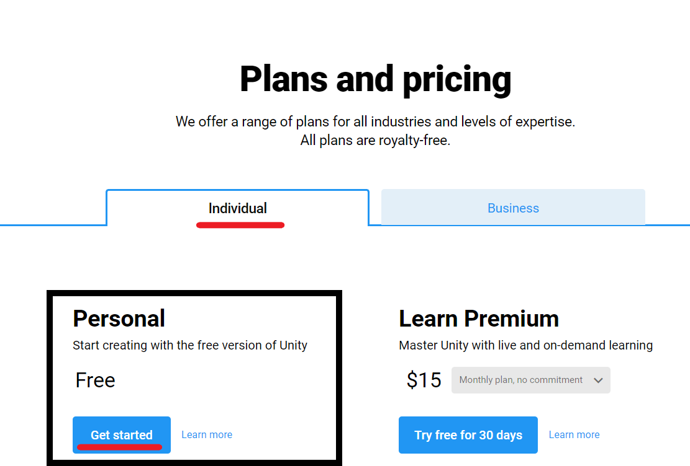

> Please select **Individual and Personal**, then press Get started for downloading)

A unity ID is needed for managing and synchronizing your unity project. If you do not have a Unity ID yet, please sign up at [https://id.unity.com](https://id.unity.com/).

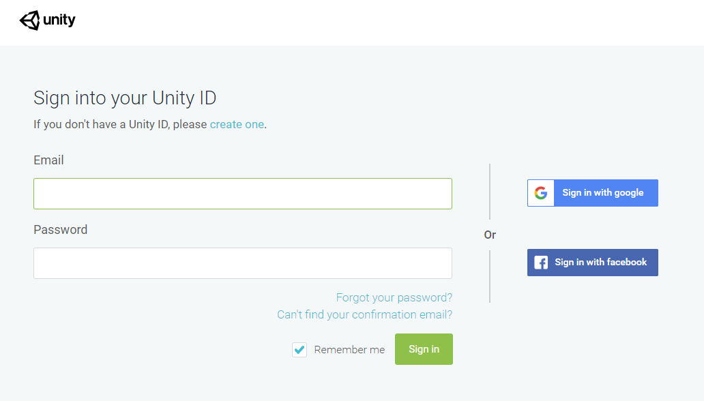


### 1.2 Metashape

**Agisoft Metashape :** is a stand-alone software product that performs photogrammetric processing of digital images and generates 3D spatial data to be used in GIS applications, cultural heritage documentation, and visual effects production as well as for indirect measurements of objects of various scales.

You can try Agisoft Metashape software either in demo mode (export and save functions are blocked) or test it in full function mode with 30-day trial license for free. Visit [here](https://www.agisoft.com/downloads/request-trial/), and provide contact data in the opened page below. The trial license will be sent to the e-mail indicated. The key will allow to activate Agisoft Metashape Professional software and test it in full function mode for 30 days.

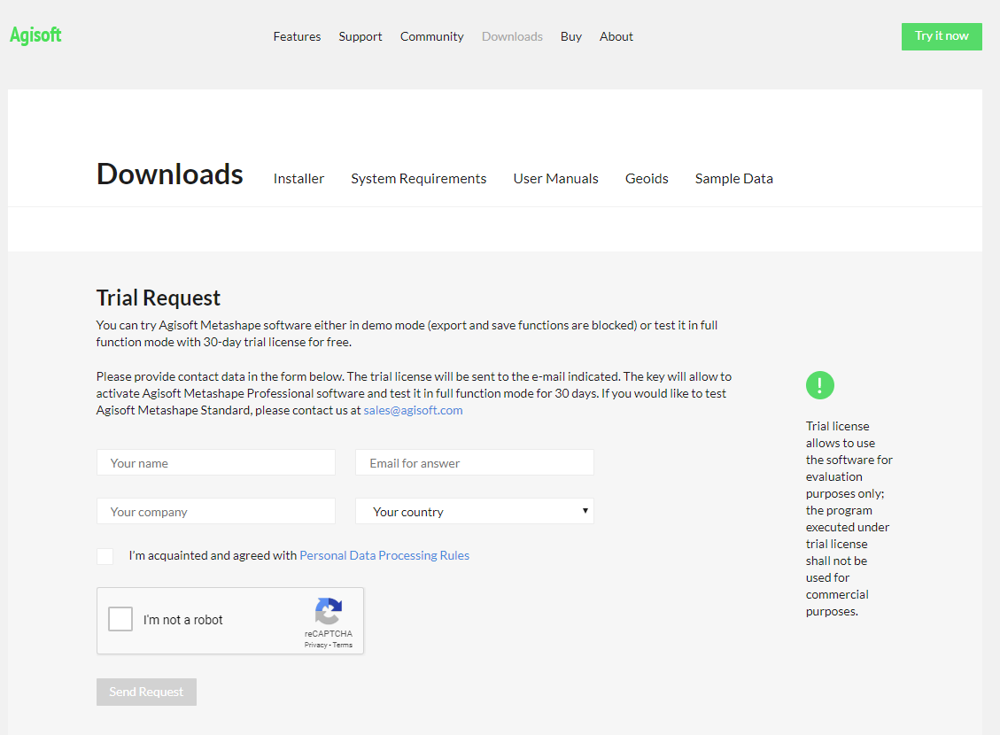

After you successfully have the activate code from Agisoft, you should be able to download your software from this page.

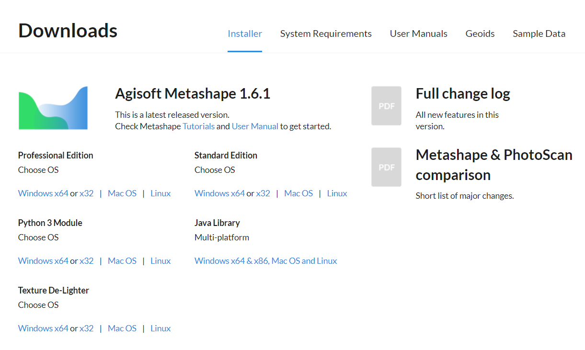

## 2\. Photo scanning

 3D scanning is the process of analyzing a real-world object or environment to collect data on its shape and possibly its appearance (e.g. colour). The collected data can then be used to construct digital 3D models.

 We are building a 3D model base on photo-scanning technology. Please use your phone or camera to take multiple images around your target. Ensuring the consistency of light is significant for creating a well-detailed model. The more pictures there are, the better the model would be. Example of taking photos are here:

 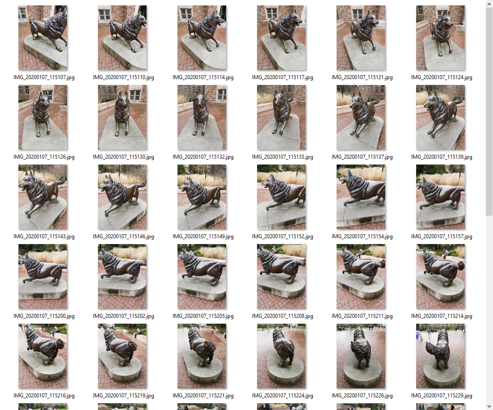

 The husky model that we have made using around 100 photos at least from multiple angles. This sample data can be found from the subfolder named [`husky`](img/husky).


> **What is point clouds and Polygon mesh models?** The point clouds produced by 3D scanners and 3D imaging can be used directly for measurement and visualization in the architecture and construction world. In a polygonal representation of a shape, a curved surface is modeled as many small faceted flat surfaces (think of a sphere modeled as a disco ball). Polygon models—also called Mesh models, are useful for visualization, for some CAM (i.e., machining), but are generally "heavy" ( i.e., very large data sets), and are relatively un-editable in this form. Reconstruction to the polygonal model involves finding and connecting adjacent points with straight lines in order to create a continuous surface. Many applications, both free and nonfree, are available for this purpose.

## 3\. Making a model

**Agisoft Metashape** is a stand-alone software product that performs photogrammetric processing of digital images and generates 3D spatial data to be used in GIS applications, cultural heritage documentation, and visual effects production as well as for indirect measurements of objects of various scales.


 Once you open the software, you enter the main interface of this software. In this user interface, all of our operations are located on these four colored squares. The largest square with the red color is where our 3D model presents `Model viewing panel`. The circle in the center is a tool for us to navigate our 3D model. It has three-axis `X`, `Y`, `Z`. Use your mouse to drag on each axis for different angels.


- The square with the blue color `Browsing panel` is where our photo appears. You can select each camera position/photo individually.

- The square with the green color is our manual toolbar `toolbar panel`. It provides function with saving, opening, clicking, zooming, and deleting.

- The yellow square *(Access panel)* is the same manual tab but in words instead of icons. Here, we shall take a glance at our project.


Next, we need to click the workflow tab. Then, we have to select `Add Photos...` or `Add Folder...`.  If you are using `Add Folder...`, please remember to pick `single cameras`. Personally, I prefer using `add photos` because it is easier to see all the pictures that you are planning to use.

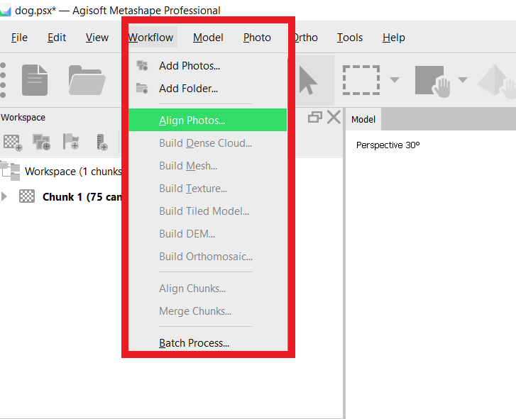

After you have added all the photos, you shall see them pop out on the workspace area - the red square on the left. You shall also notice the dots on your model interface. Each dot represents a virtual camera position,  and the computer uses these dots to align photos for creating a 3D realistic environment.

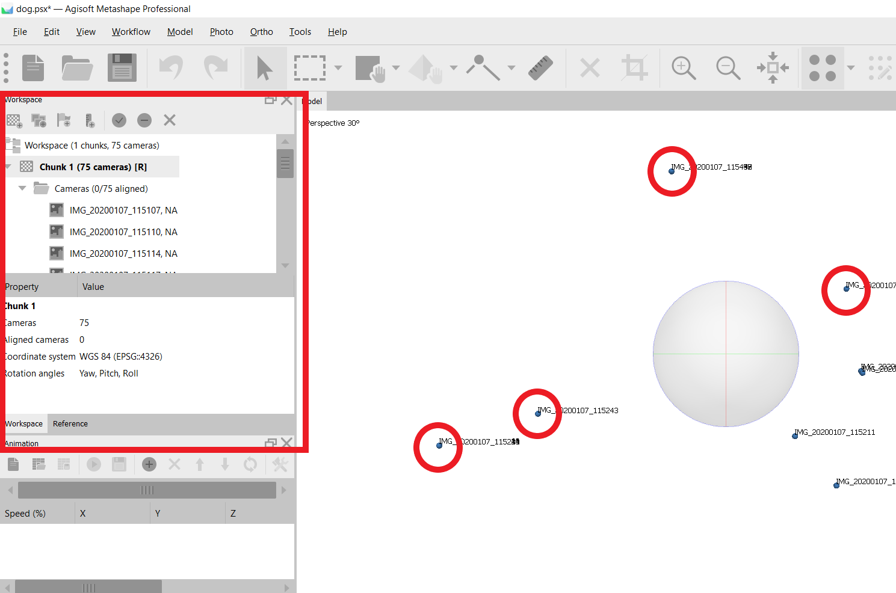


Before we enter the next phase, I strongly recommend you to check the preference setting under the tools.

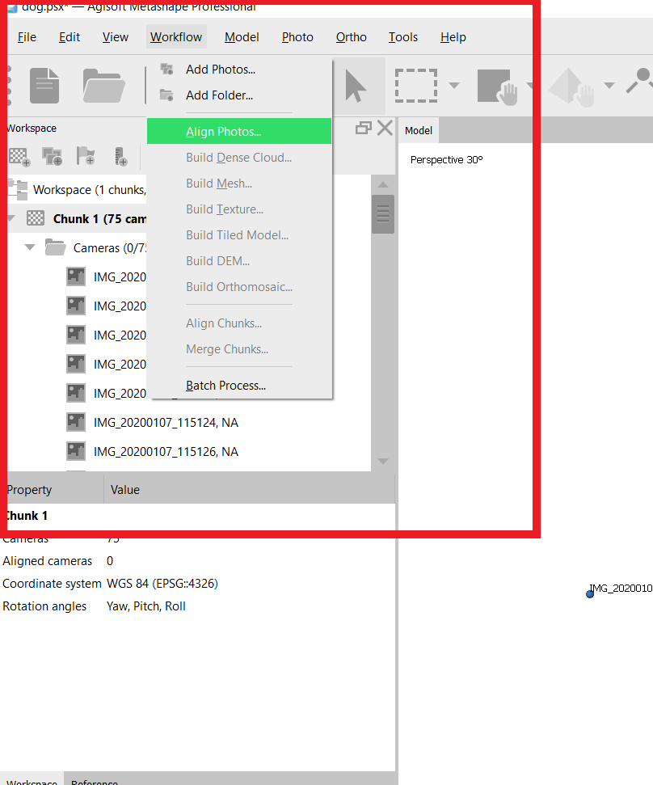

Here, you can change the language or all the default settings. You can check your GPU for the 3D modeling. I would recommend you to select the box for using CPU when performing GPU accelerated processing. Basically, this function splits the large amounts of work between GPU and CPU, and it should reduce your waiting time.

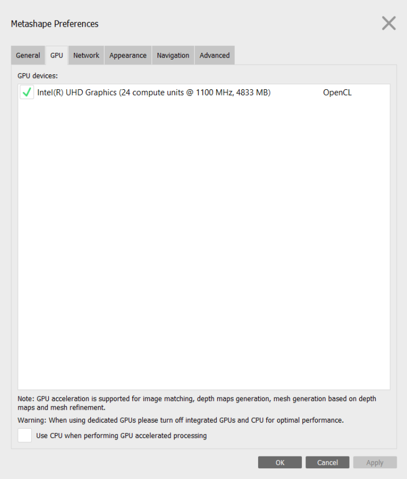


<!-- 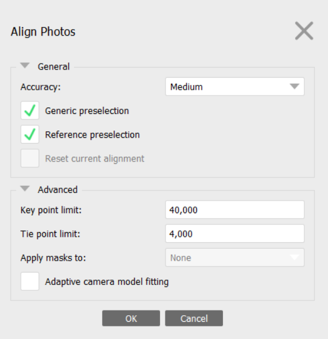 -->

**3D model Simplification**

To complete the task of making a 3D model of the husky dog, I would strongly suggest you of using the Area `Select tool` in the red square and delete button on your keyboard to delete the unnecessary points. As you can see from the screenshot, the blue circled areas are irrelevant, those the position of the cameras.

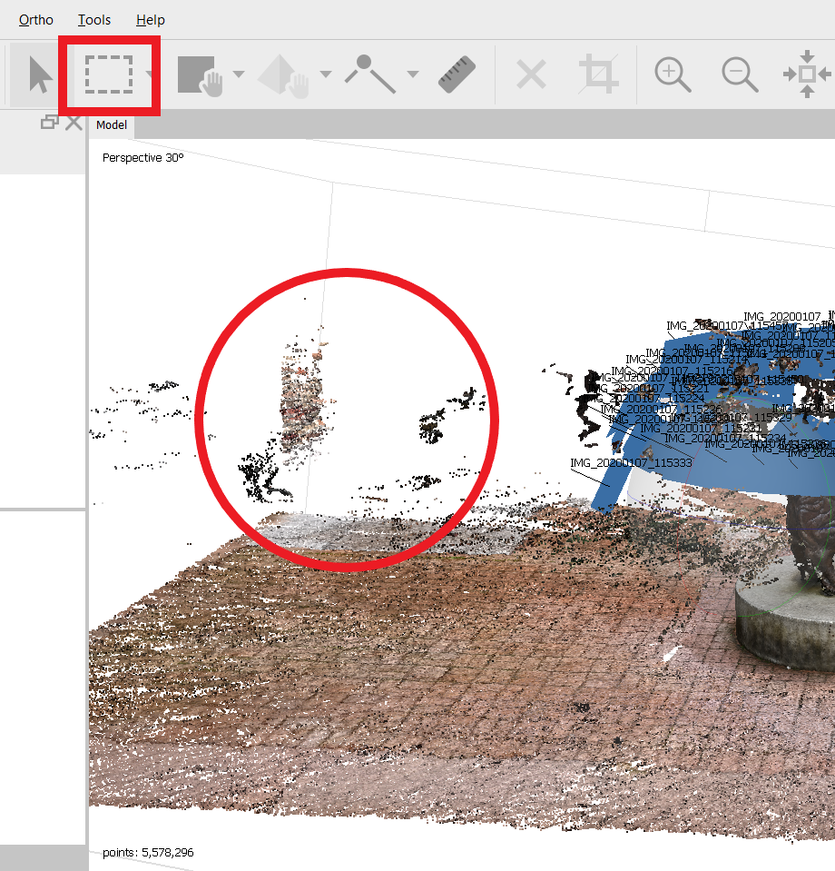

In this case, everything that you deleted would not be calculated or projected on the final stage.

As you can see after the construction of 3D mesh and dense cloud, this basically builds up the final 3D model. However, we still have the last step to do --- polish the model.

<!--  -->

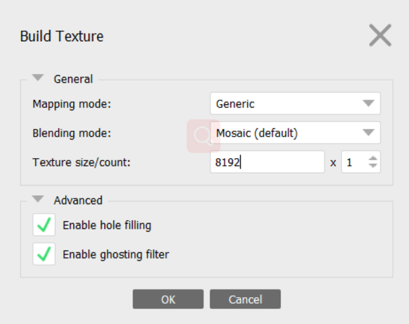

The higher the texture size is, the better your model is going to appear in the final model.

**Texture size recommend: 8192 / 4096 / 2048 / 1024**
**Remember to save your model first.**

Then nagvigate through the `File` on top menu,and then `Export` --> `Export Model`.

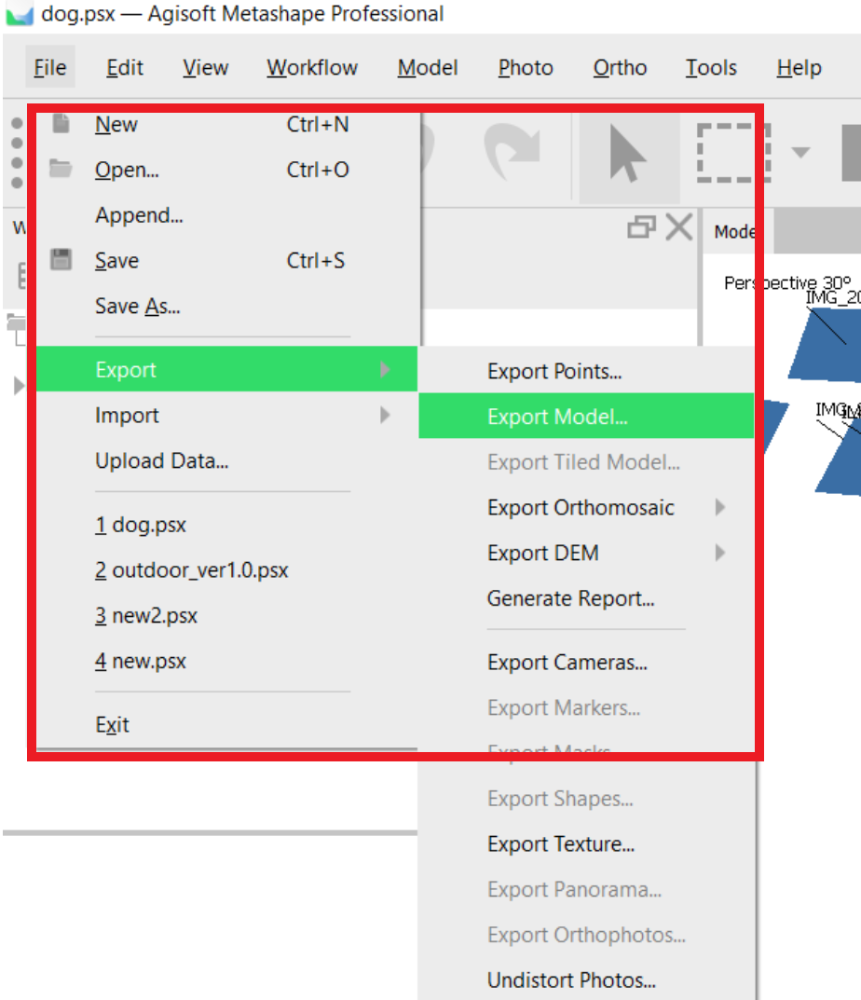

You are welcome to adjust any setting if you want. Shift X, Y, Z coordinate - move or rotate the actual model. The data format of the model could be `dae`, `obj`, `fbx`, and you can export texture in the image as the format of `jpeg`, `png`, `tiff`, and `exr`.


## 4. Creating Virtual Reality

In this section, we will walk through the steps of creating a VR out of the 3D model you have made in the previous section.

> Remember you need a unity account to start the next part.

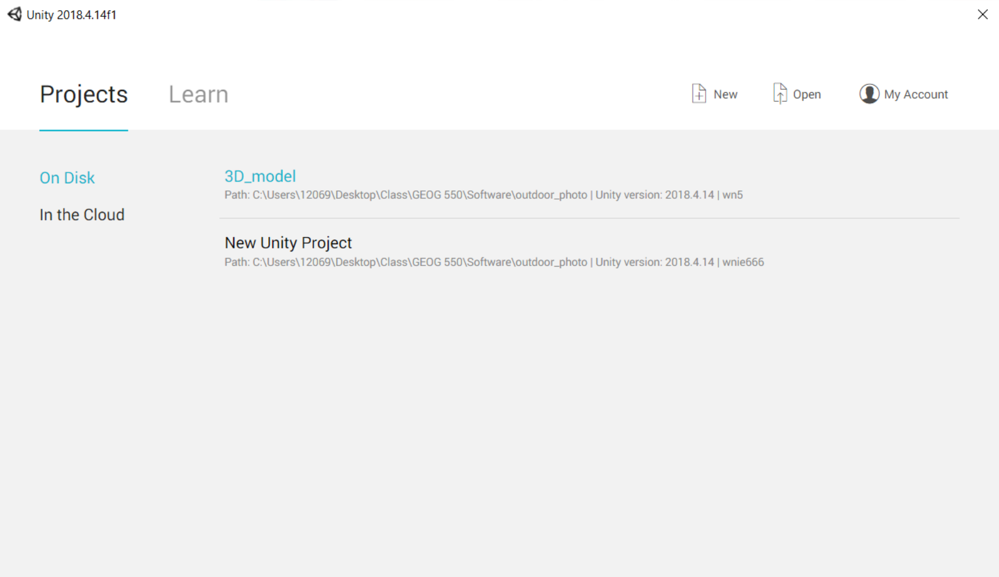

Once you open Unity, you will see an graphic interface as below.

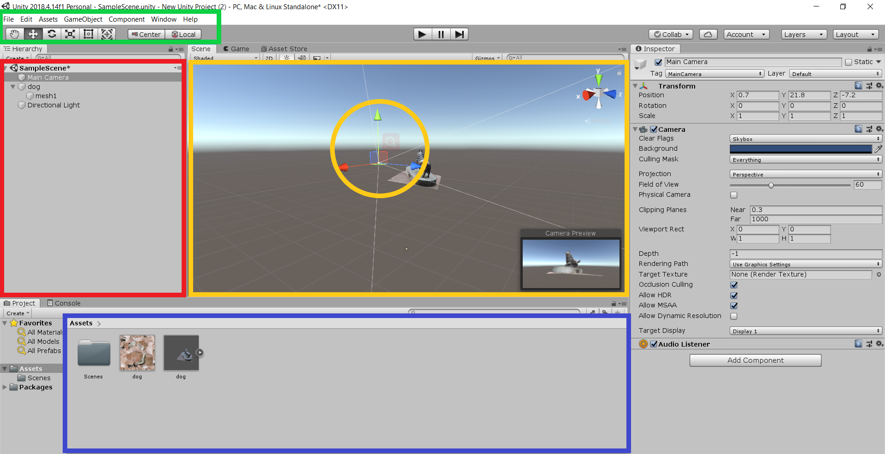

- The top green frame is basic function bar/toolbar, you can save/delete/rotate/change camera position.

- The red frame is the browsing panel. All your materials/object in the game shall be presented here. We recommend you to unpack all the prefab when you are importing the 3D model and texture. In this case, it is easier to access or manipulate your camera.

- The blue frame shows the assets panel. All of your imported assets should be illustrated (you can also import assets by right click on the panel).

- At last, we have our view panel in the yellow frame. The yellow circle on pops up if you select your object from the browsing panel, it has a triangular shape arrows. Use it to move the object in X,Y,Z vector direction(you can also drag the square).

> I strongly recommend you to watch this youtube tutorial on using unity (check [here](https://www.youtube.com/watch?v=IlKaB1etrik)), especially from 1:35 to 5:00. Also, we realize that using a mouse (instead of touchpad) is much easilier to control objects in the unity. please use a mouse to control unity.


At the bottom of the Assets window, please use `import`. Select the model you exported earlier from Agisoft and the texture.

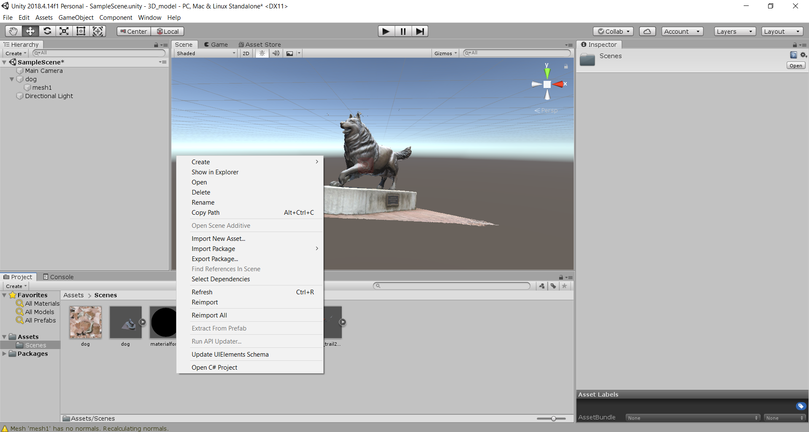

Please import the two files at once, like what we did in the image below. In this case, the texture should automatically be recognized and attached to the 3D model. If your model still appears with empty texture, you can manually drag the texture onto the model to finish it.

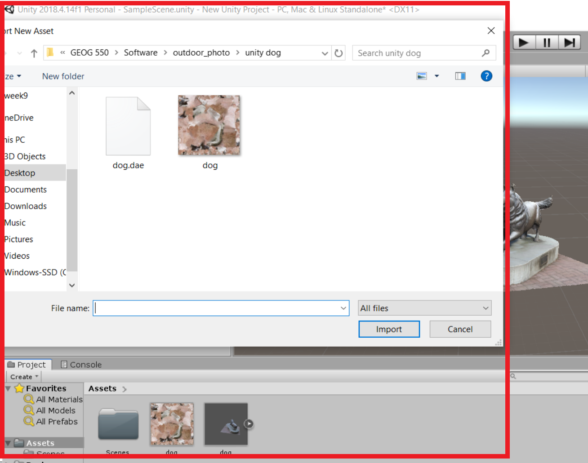

> If you do not like so many cameras appearing on your model, you can unpack prefab completely by right click on the objects.


Congrats! Now your 3D model is done. You can just adjust the position/camera for your VR.

To activate the VR setting in Unity just go through this website.
([Click here to watch the VR setting in Unity](https://docs.unity3d.com/Manual/VROverview.html))

Furthermore, you can export this VR to different settings.  In the build setting, you can have the option of running on Windows, Mac, Android, even Linux. If you want to export on PC/MAC/Linux, select your target platform. To do so, you need to click "file" on the top toolbar, and then type `Build Settings...`

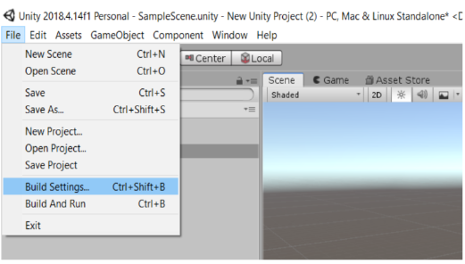

For windows Users, architecture X86-64 is good for most of the computer. You should leave the rest unselected (Sever Build, Copy PDB Build, Create Visual Studio Solution, and development Build). Also, leave it to default for Compression method. There are also a Player Settings on the lower left corner. You are welcome to change/adjust your intended equipment/icon by using the player setting. To change the VR equipment, you should find "XR Settings" under the Player Settings menu.*

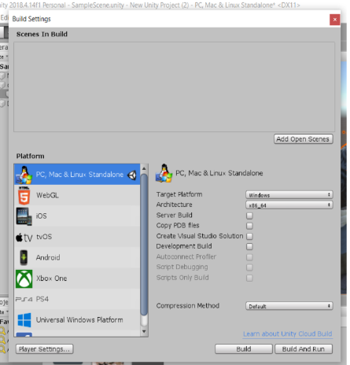

## 5. VR experience

Once you the VR model of the husky is made, you are able to watch it in a VR Goggle. In this section, you do not need to do anything. In one of our class, we will provide the VR goggle for you to watch the model you have made.

*Virtual reality (VR)* is a simulated experience that can be similar to or completely different from the real world. Applications of virtual reality can include entertainment (i.e. video games) and educational purposes (i.e. medical or military training). Other, distinct types of VR style technology include augmented reality and mixed reality.

Currently standard virtual reality systems use either virtual reality headsets or multi-projected environments to generate realistic images, sounds and other sensations that simulate a user's physical presence in a virtual environment. A person using virtual reality equipment is able to look around the artificial world, move around in it, and interact with virtual features or items. The effect is commonly created by VR headsets consisting of a head-mounted display with a small screen in front of the eyes, but can also be created through specially designed rooms with multiple large screens. Virtual reality typically incorporates auditory and video feedback, but may also allow other types of sensory and force feedback through haptic technology.

In my experiment, you can take a glance at the potential of Virtual Reality. Imaging we recreate our world in the a massive computer game, we can approach to so many things that we could not do in reality. There is already study for using VR to help people recover from PTSD. There are also studies focus on the entertainment, the social experiment, and the psychological phenomena in VR. Although the future looks prominent, there are still some minor issues of VR.

>Motion sickness occurs due to a difference between actual and expected motion. Symptoms commonly include nausea, vomiting, cold sweat, headache, sleepiness, yawning, loss of appetite, and increased salivation. Complications may rarely include dehydration, electrolyte problems, or a lower esophageal tear. Also, user Isolation occurs due to the usage of virtual reality. The players sink into their world with little notice to the actual world. This sort of isolation could lead to anxiety and frustration.


## Deliverable

For the deliverable of this practical excercise, you are expected to make your own 3D model using the skills you learned in this class. Since the demo version of the metashape does not allow you export the 3D model, please take (at least three) screenshots of your 3D model in different perspectives (20 POINTS).

And then export the 3d model to unity, and take (at least three) screenshots too (20 POINTS),

Create a repository to store the screenshots and then summarize your work in the `readme.md` file, and insert the screenshots to the `readme.md` file too (10 POINTS).


To submit your deliverable, please share the url of the Github repository to the **Canvas Dropbox** of this practical exercise. The file structure of this github repository should look like below.

```powershell
[your_repository]
    │
    │readme.md
    ├─img
    │    screenshots
```

**Note:** Lab assignments are required to be submitted electronically to Canvas unless stated otherwise. Efforts will be made to have them graded and returned within one week after they are submitted.Lab assignments are expected to be completed by the due date. ***A late penalty of at least 10 percentage units will be taken off each day after the due date.*** If you have a genuine reason(known medical condition, a pile-up of due assignments on other courses, ROTC,athletics teams, job interview, religious obligations etc.) for being unable to complete work on time, then some flexibility is possible. However, if in my judgment you could reasonably have let me know beforehand that there would likely be a delay, and then a late penalty will still be imposed if I don't hear from you until after the deadline has passed. For unforeseeable problems,I can be more flexible. If there are ongoing medical, personal, or other issues that are likely to affect your work all semester, then please arrange to see me to discuss the situation. There will be NO make-up exams except for circumstances like those above.
