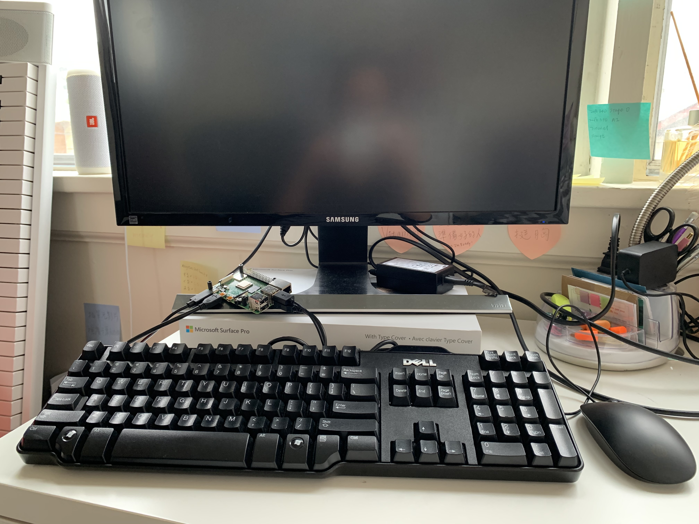

# Practical Exercise 7: Environmental data collection in real time with Raspberry Pi

In this practical exercise, we will introduce how to collect environmental data in real time using Raspberry Pi. A Raspberry Pi is a low cost, credit-card size electronic board that is able to do everything a computer can do. In this exercise, we will use Sense HAT to collect environmental data (pressure, temperature, and humidity), and Raspberry Pi Camera Module to conduct deep learning based image recognition. Lastly, we will use real time GIS to sync our collected data to the cloud. Ok, let us get started!

## 1. Preparation

### 1.1 Hardware

  - [Raspberry Pi 4 Model B](https://www.amazon.com/Raspberry-Model-2019-Quad-Bluetooth/dp/B07TC2BK1X/ref=sr_1_5?keywords=raspberry+pi&qid=1579033237&sr=8-5)
      - Although I am using the latest version, you can check out the older versions with lower cost on this [page](https://www.raspberrypi.org/products/).
  - [NOOBS Preloaded Micro SD Card](https://www.amazon.com/Raspberry-Noobs-Preloaded-Compatible-Models/dp/B07LB7L3D9/ref=sr_1_7?keywords=raspberry+pi+preloaded+sd+card+noobs&qid=1579036836&sr=8-7)
      - You can also buy a plain SD card and install NOOBS/Raspbian yourself (https://www.raspberrypi.org/downloads/).
  - [Sense HAT](https://www.amazon.com/Raspberry-Pi-Sense-HAT-AstroPi/dp/B014HDG74S)
  - [Camera Module (Standard Version)](https://www.amazon.com/Raspberry-Pi-Camera-Module-Megapixel/dp/B01ER2SKFS?ref_=ast_bbp_dp&th=1&psc=1)
  - [Camera Module (Night Version)](https://www.amazon.com/Raspberry-Pi-Camera-Module-Megapixel/dp/B071WP53K7?ref_=ast_bbp_dp&th=1) (optional)
  - [Solar recharger](https://www.amazon.com/24000mAh-Waterproof-Portable-Compatible-Smartphones/dp/B07C24XC2L/ref=sr_1_1_sspa?keywords=solar+recharger&qid=1579034413&s=electronics&sr=1-1-spons&psc=1&spLa=ZW5jcnlwdGVkUXVhbGlmaWVyPUEyN0FRQkdNQ0JIS1paJmVuY3J5cHRlZElkPUEwOTAyNjk1MjZQRldTMDRKOFM2ViZlbmNyeXB0ZWRBZElkPUEwNjA3NTAwM04xMjJMSlBRMElLRCZ3aWRnZXROYW1lPXNwX2F0ZiZhY3Rpb249Y2xpY2tSZWRpcmVjdCZkb05vdExvZ0NsaWNrPXRydWU=) (optional) usage outdoor deployment
  - Monitor, Mouse, Keyboard (configuration)

The total cost is around $150 in total, depending on the amount of accessary added. Besides Sense HAT, there are other [sensors]( https://www.amazon.com/kuman-K5-USFor-Raspberry-Projects-Tutorials/dp/B016D5L5KE/ref=sr_1_3?crid=2AQDFL3J1N0TQ&keywords=raspberry+pi+sensors&qid=1578694540&sprefix=rasp%2Caps%2C199&sr=8-3) available online for purchase. If you are interested in learning some cool projects that Raspberry Pi can do, check out this [article](https://www.ubuntupit.com/20-best-raspberry-pi-projects-that-you-can-start-right-now/)!


### 1.2 Environment Setup and Software Installation

1.2.1 Assemably
  

  

  

  After everything is plugged in, the environment setup should look like this:

  


1.2.2 Raspberry Pi Installation Operating System (Linux)

Now, we can go ahead and turn on the Raspberry Pi. On the first boot, the system will automatically expand the file system on the SD card.

  

It will automatically reboot, and you will see a rainbow screen.

  

After a few seconds, it will bring you to the Raspbian desktop.

  

Complete the following steps to set up Raspberry Pi:

>  - Click [Next].
>  - Set [Country] to "United States"; [Language] to "American English"; [Timezone] to "Los Angeles".
>  - Check both [Use English language] and [Use US keyboard].
>  - Click [Next].
>  - It is highly encouraged to create a new password. But if not, the original password is "raspberry".
>  - Click [Next].
>  - Select a WiFi network and click [Next], or [Skip] to continue without connecting.
>  - Click [Next].
>  - Enter the WiFi password and click [Next], or [Skip] to continue without connecting.
>  - Update Software: Click [Next].
>  - Click [OK].
>  - Click [Restart].
>  - Now we are ready to use Raspbeery Pi as a PC.

1.2.4 Install Sense HAT Packages and Connect Camera Module

  - Connect to WiFi or ethernet.
  - Open Terminal (Shortcut: Ctrl + Alt + T).

  
  - Within the terminal window, type in the following commands to install Sense HAT.
  ```shell
  sudo apt-get update # manually update the operating system
  sudo apt-get install sense-hat # install the Sense HAT package
  ```
  - To connect the Camera Module, click [Menu] > [Preferences] > [Raspberry Pi Configuration]:

  
  - Select [Interfaces] and ensure that the camera is "Enabled":

  

  - Click [OK].
  - Open the terminal window and type in the following command.
  ```shell
  sudo reboot # reboot Raspberry Pi
  ```

  1.2.5 Test Out Python Codes

  Now we will learn how to control Sense Hat and Pi Camera Module using Python codes.
  - To open Python IDE, click [Menu] > [Programming] > [Thonny Python IDE].
  - In your Python program, type in the following lines of code to set up your connection with the Sense HAT:
  ```Python
  from sense_hat import SenseHat
  sense = SenseHat()
  ```
  - Add this code to display a message on the Sense HAT's LED matrix.
  ```Python
  sense.show_message("Hello RPi")
  ```
  - Save your file as "Test Sense HAT.py" on your desktop.
  - Click the green play button to execute the codes. The message is displayed:

  

  - Open a new file.
  - Enter the following codes:
  ```Python
  from picamera import picamera
  from time import sleep

  camera = PiCamera()

  camera.start_preview()
  sleep(5)
  camera.capture('/home/pi/Desktop/image.jpg')
  camera.stop_preview()
  ```
  - Save your file as "Test Camera.py" on your desktop then run the codes.
  - Your new image should be saved to the Desktop:
  


<!--
# - Python 3
    - Sense HAT for Python 3
    - python library for camera

1.2.3 Turn on the RPi

```
>>>pip install XXXX
```

1.2.4 install prerequsite pakages and python libraries

```shell
sudo apt-get update
sudo apt-get install sense-hat
sudo reboot
```


1.2.5 Log in info:
  - update username and pwd.(optional)

1.2.5 Test:

```python
from sense_hat import SenseHat

sense = SenseHat()

sense.show_message("Hello world!")
```

>
> major python libraries
>  - tensorflow or pytorch
>  - pycamera (double check?)
>  - sensor (double check?)
> - scheduler - crontab
>  - real-time publish the data to a github
> repo (the cloud side).

-->

## 2. Monitoring the environmental variables

The Sense HAT has a set of environmental sensors for detecting the surrounding conditions; it can measure pressure, temperature, and humidity.

refer to the [`01_env_sensor.py`](01_env_sensor.py).

import the library for XXX
```Python
from sense_hat import SenseHat
```

next, declare vavriable to

```python
sense = SenseHat()
sense.clear()
```
XXXXXX
```python
temp = sense.get_temperature()
humidity = sense.get_humidity()
pressure = sense.get_pressure()

print("temp: %.2f, humidity: %.2f, pressure: %.2f" % (pressure, temp, humidity))

```


## 3. Recognizing objects from images/videos

3.1 tensorflow, image recognition
3.2

## 4. Synchronizing data to the cloud

[client(RPI)] <----> Server <-----> [Cloud Storage(GitHub(command line), Dropbox[python dropbox], Google Drive[python google dirve], Linux[rsync])]

1. open terminal
2. in the teminal UI,

```shell
crontab -e
```

3. in the crontab editor,

```shell
*/2 * * * *  /file_path/iot.sh
```

Crtl+X to close the crontab editor

4. activiate the schedule

```shell
sudo service cron restart
```

5. iot.sh

```sh
#!/bin/sh
432/432/432/4/python env_sensor.py
cd ../repo_local_path
git checkout -f
git pull
git commit -i "update"
git push
```


3. Schedule a cron to execute on every minutes.
Generally, we don’t require any script to execute on every minute but in some case, you may need to configure it.

*/2 * * * *  /scripts/script.sh


0 17 * * sun  /scripts/script.sh
5. Schedule a cron to execute on every 10 minutes.
If you want to run your script on 10 minutes interval, can configure like below. These type of crons are useful for monitoring.

*/10 * * * * /scripts/monitor.sh

## References


https://projects.raspberrypi.org/en/projects/getting-started-with-the-sense-hat

https://projects.raspberrypi.org/en/projects/getting-started-with-picamera

https://www.raspberrypi.org/documentation/hardware/sense-hat/


https://picamera.readthedocs.io/en/release-1.13/recipes1.html

https://github.com/bennuttall/sense-hat-examples/blob/master/python/astro_cam.py

Cameras: https://www.amazon.com/Raspberry-Pi-Camera-Module-Megapixel/dp/B01ER2SKFS?ref_=ast_bbp_dp&th=1&psc=1


**python libraries**

https://pypi.org/project/sense-hat/

https://github.com/astro-pi/python-sense-hat

https://github.com/bennuttall/sense-hat-examples
