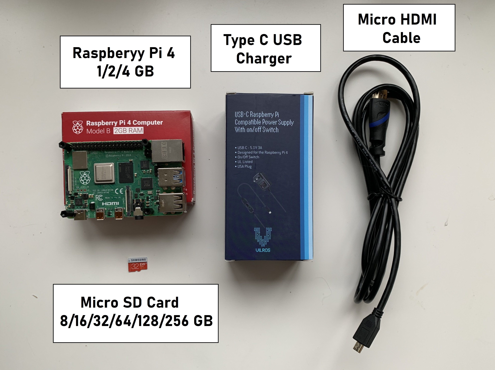

# Practical Exercise 7: Environmental data collection in real time with Raspberry Pi

**Meeting:** Wednesdays, 2:30 - 5:20, SMI 109

**Instructor:** Bo Zhao, SMI 416B, Office hours by appointment

**Authors:** Bo Zhao, Angel Lin

**Contact:** 206.685.3846, zhaobo@uw.edu, jakobzhao (skype/wechat)

In this practical exercise, we will introduce how to collect environmental data in real time using Raspberry Pi. A Raspberry Pi is a low cost, credit-card size electronic board that is able to do everything a computer can do. In this tutorial, we will use Sense HAT to collect environmental data (pressure, temperature, and humidity), and Raspberry Pi Camera Module to conduct deep learning based image recognition. Lastly, we will use real time GIS to sync our collected data to the cloud. Ok, let us get started!

## 1. Preparation

### 1.1 Hardware

  - [Raspberry Pi 4 Model B](https://www.amazon.com/Raspberry-Model-2019-Quad-Bluetooth/dp/B07TC2BK1X/ref=sr_1_5?keywords=raspberry+pi&qid=1579033237&sr=8-5)
      - Although I am using the latest version, you can check out the older versions with lower cost on this [page](https://www.raspberrypi.org/products/).
  - [NOOBS Preloaded Micro SD Card](https://www.amazon.com/Raspberry-Noobs-Preloaded-Compatible-Models/dp/B07LB7L3D9/ref=sr_1_7?keywords=raspberry+pi+preloaded+sd+card+noobs&qid=1579036836&sr=8-7)
      - You can also buy a plain SD card and install NOOBS/Raspbian yourself (https://www.raspberrypi.org/downloads/).
  - [Sense HAT](https://www.amazon.com/Raspberry-Pi-Sense-HAT-AstroPi/dp/B014HDG74S)
  - [Camera Module (Standard Version)](https://www.amazon.com/Raspberry-Pi-Camera-Module-Megapixel/dp/B01ER2SKFS?ref_=ast_bbp_dp&th=1&psc=1)
  - [Camera Module (Night Version)](https://www.amazon.com/Raspberry-Pi-Camera-Module-Megapixel/dp/B071WP53K7?ref_=ast_bbp_dp&th=1) (optional)
  - [Solar recharger](https://www.amazon.com/24000mAh-Waterproof-Portable-Compatible-Smartphones/dp/B07C24XC2L/ref=sr_1_1_sspa?keywords=solar+recharger&qid=1579034413&s=electronics&sr=1-1-spons&psc=1&spLa=ZW5jcnlwdGVkUXVhbGlmaWVyPUEyN0FRQkdNQ0JIS1paJmVuY3J5cHRlZElkPUEwOTAyNjk1MjZQRldTMDRKOFM2ViZlbmNyeXB0ZWRBZElkPUEwNjA3NTAwM04xMjJMSlBRMElLRCZ3aWRnZXROYW1lPXNwX2F0ZiZhY3Rpb249Y2xpY2tSZWRpcmVjdCZkb05vdExvZ0NsaWNrPXRydWU=) (optional) usage outdoor deployment
  - Monitor, Mouse, Keyboard (configuration)

The total cost is around $150 in total, depending on the amount of accessary added. Besides Sense HAT, there are other [sensors]( https://www.amazon.com/kuman-K5-USFor-Raspberry-Projects-Tutorials/dp/B016D5L5KE/ref=sr_1_3?crid=2AQDFL3J1N0TQ&keywords=raspberry+pi+sensors&qid=1578694540&sprefix=rasp%2Caps%2C199&sr=8-3) available online for purchase. If you are interested in learning some cool projects that Raspberry Pi can do, check out this [article](https://www.ubuntupit.com/20-best-raspberry-pi-projects-that-you-can-start-right-now/)!


### 1.2 Environment Setup and Software Installation

1.2.1 Assemably
  

  

  

  After everything is plugged in, the environment setup should look like this:

  


1.2.2 Raspberry Pi Installation Operating System (Linux)

Now, we can go ahead and turn on the Raspberry Pi. On the first boot, the system will automatically expand the file system on the SD card.

  

It will automatically reboot, and you will see a rainbow screen.

  

After a few seconds, it will bring you to the Raspbian desktop.

  

Complete the following steps to set up Raspberry Pi:

>  - Click [Next].
>  - Set [Country] to "United States"; [Language] to "American English"; [Timezone] to "Los Angeles".
>  - Check both [Use English language] and [Use US keyboard].
>  - Click [Next].
>  - It is highly encouraged to create a new password. But if not, the original password is "raspberry".
>  - Click [Next].
>  - Select a WiFi network and click [Next], or [Skip] to continue without connecting.
>  - Click [Next].
>  - Enter the WiFi password and click [Next], or [Skip] to continue without connecting.
>  - Update Software: Click [Next].
>  - Click [OK].
>  - Click [Restart].
>  - Now we are ready to use Raspbeery Pi as a PC.

1.2.4 Install Sense HAT Packages and Connect Camera Module

  - Connect to WiFi or ethernet.
  - Open Terminal (Shortcut: Ctrl + Alt + T).

  
  - Within the terminal window, type in the following commands to install Sense HAT.
  ```shell
  sudo apt-get update # manually update the operating system
  sudo apt-get install sense-hat # install the Sense HAT package
  ```
  - To connect the Camera Module, click [Menu] > [Preferences] > [Raspberry Pi Configuration]:

  
  - Select [Interfaces] and ensure that the camera is "Enabled":

  

  - Click [OK].
  - Open the terminal window and type in the following command.
  ```shell
  sudo reboot # reboot Raspberry Pi
  ```

  1.2.5 Test Out Python Codes

  Now we will learn how to control Sense Hat and Pi Camera Module using Python codes.
  - To open Python IDE, click [Menu] > [Programming] > [Thonny Python IDE].
  - In your Python program, type in the following lines of code to set up your connection with the Sense HAT:
  ```Python
  from sense_hat import SenseHat
  sense = SenseHat()
  ```
  - Add this code to display a message on the Sense HAT's LED matrix.
  ```Python
  sense.show_message("Hello RPi")
  ```
  - Save your file as "Test Sense HAT.py" on your desktop.
  - Click the green play button to execute the codes. The message is displayed:

  

  - Open a new file to try out codes for taking pictures.
  - Enter the following codes:
  ```Python
  from picamera import picamera
  from time import sleep

  camera = PiCamera()

  camera.start_preview()
  sleep(5)
  camera.capture('/home/pi/Desktop/image.jpg')
  camera.stop_preview()
  ```
  - Save your file as "Test Camera.py" on your desktop then run the codes.
  - Your new image should be saved to the Desktop:
  


## 2. Sense HAT: Monitoring the Environmental Variables

The Sense HAT has a set of environmental sensors for detecting the surrounding conditions, including:
- Gyroscope
- Accelerometer
- Magnetometer
- Temperature
- Barometric pressure
- Humidity

For this tutorial, we will use python code to measure temperature, humidity, and pressure (please refer to  [`01_env_sensor.py`](01_env_sensor.py).)

In a Python file, enter the following code:
```Python
from sense_hat import SenseHat
sense = SenseHat() # declare variable
sense.clear()

temperature = sense.get_temperature()
humidity = sense.get_humidity()
pressure = sense.get_pressure()

print("temperature: %.2f, humidity: %.2f, pressure: %.2f" % (temperature, humidity, pressure))
```
After running the program, you should get something like this:
```Python
temperature: 37.74, humidity: 31.91, pressure: 1010.81
```
It would be useful if the data can be stored somewhere. For this exercise, we will store our environmental data in to a CSV file. To write the data to a file, you first need to create it. At the end of the program, add the following line:
```Python
with open("assets/env.csv", "a", encoding="utf8") as fp:
```
This creates a new file called "env.csv" and opens it with the hZame "fp". It also opens it in append mode, so that lines are only written to the end of the file. Now you want to write the current timestamp, temperature, humidity, and pressure data to the CSV file:
```Python
# fp.write("temp: %.2f, humidity: %.2f, pressure: %.2f" % (pressure, temp, humidity))
with open("assets/env.csv", "a", encoding="utf8") as fp:
  fp.write("%d, %.2f, %.2f, %.2f \n" % (timestamp, pressure, temp, humidity))
```

## 3. Synchronizing Data to the Cloud

[client(RPI)] <----> Server <-----> [Cloud Storage(GitHub(command line), Dropbox[python dropbox], Google Drive[python google dirve], Linux[rsync])]

Automating scripts is simple with `crontab`. It is used to schedule commands or scripts to run periodically and at fixed intervals.

1. To begin, open up a terminal window.
2. Run `crontab` with the `-e` flag to edit the cron table:

```shell
crontab -e
```
3. When you first run the `crontab -e` command, you will be asked to select an editor to use. For now, let's use `/bin/nano`.

4. In the `crontab` editor, you can add new cron jobs with this syntax:

```powershell
    *    *    *    *    *
    │    │    │    │    │─────────── Day of week (0 - 7) (Sunday = 0 or 7)
    │    │    │    │──────────────── Month (1 - 12)
    │    │    │───────────────────── Day of month (1 - 31)
    │    │────────────────────────── Hour (0 - 23)
    │─────────────────────────────── Minute (0 - 59)
```

For this exercise, we will run the shell file every minute. The  [`iot.sh`](iot.sh) file includes codes that (1) pull the latest data from GitHub (2) run the [`01_env_sensor.py`](01_env_sensor.py) to collect temperature, pressure, and humidity data and (3) push the collected data back to GitHub. We can automate this process using `crontab` with the following code:

```shell
* * * * * sh [local_repository_path]/iot.sh # run iot.sh every minute
```
5. To exit the editing environment, press `Crtl+X` and then `Y`.

6. To activate the `crontab` schedule, type:

```shell
sudo service cron restart
```
7. To check the log, type:

```shell
sudo tail -f /var/log/syslog | grep CRON
```
Now, as long as there is power supply, the Raspberry Pi will automatically collect environmental data and update them do the cloud. You can view the real time data via GitHub.

<!--

## 4. Recognizing objects from images/videos

3.1 tensorflow, image recognition
3.2
-->
## 4. Deliverable

For the deliverable of this practical excercise, you are expected to collect continous environment data and save it into a github repository. (40 POINTS)

You are also expected to store the python and shell scripts to the repository (5 POINTS) and summarize what you have done in the readme.md (5 POINTS)


Create a repository to store the screenshots and then summarize your work in the `readme.md` file, and insert the screenshots to the `readme.md` file too (10 POINTS).

Also, we encourage you try to visualize the colected data using charts. Please refer to the [index.html](index.html) script under the 08_iot folder. This script can be openly accessed from this link: https://jakobzhao.github.io/geog595/08_iot/.


To submit your deliverable, please share the url of the Github repository to the **Canvas Dropbox** of this practical exercise. The file structure of this github repository should look like below.


```powershell
[your_repository]
    │
    │readme.md
    ├─assets
    │    env.csv  # a timely updated data file of the monitored environmental parameters.
```


**Note:** Lab assignments are required to be submitted electronically to Canvas unless stated otherwise. Efforts will be made to have them graded and returned within one week after they are submitted.Lab assignments are expected to be completed by the due date. ***A late penalty of at least 10 percentage units will be taken off each day after the due date.*** If you have a genuine reason(known medical condition, a pile-up of due assignments on other courses, ROTC,athletics teams, job interview, religious obligations etc.) for being unable to complete work on time, then some flexibility is possible. However, if in my judgment you could reasonably have let me know beforehand that there would likely be a delay, and then a late penalty will still be imposed if I don't hear from you until after the deadline has passed. For unforeseeable problems,I can be more flexible. If there are ongoing medical, personal, or other issues that are likely to affect your work all semester, then please arrange to see me to discuss the situation. There will be NO make-up exams except for circumstances like those above.


## References

https://projects.raspberrypi.org/en/projects/getting-started-with-the-sense-hat

https://projects.raspberrypi.org/en/projects/getting-started-with-picamera

https://www.raspberrypi.org/documentation/hardware/sense-hat/

https://picamera.readthedocs.io/en/release-1.13/recipes1.html

https://github.com/bennuttall/sense-hat-examples/blob/master/python/astro_cam.py

https://www.amazon.com/Raspberry-Pi-Camera-Module-Megapixel/dp/B01ER2SKFS?ref_=ast_bbp_dp&th=1&psc=1


**python libraries**

https://pypi.org/project/sense-hat/

https://github.com/astro-pi/python-sense-hat

https://github.com/bennuttall/sense-hat-examples
